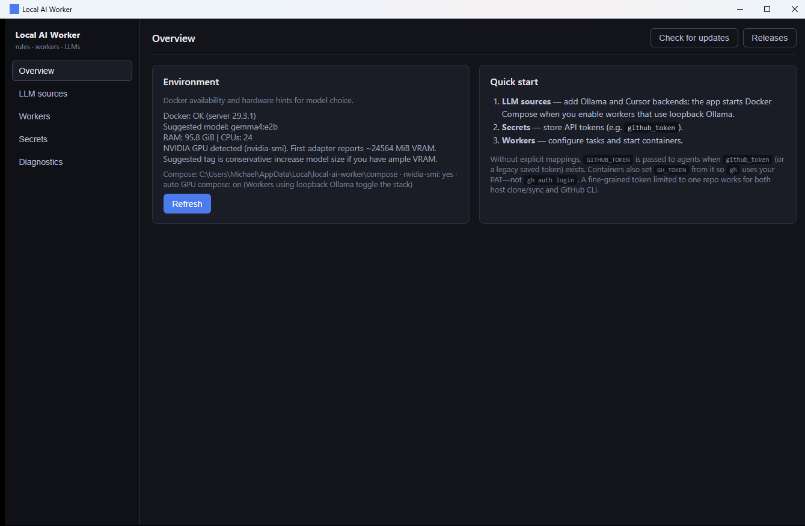
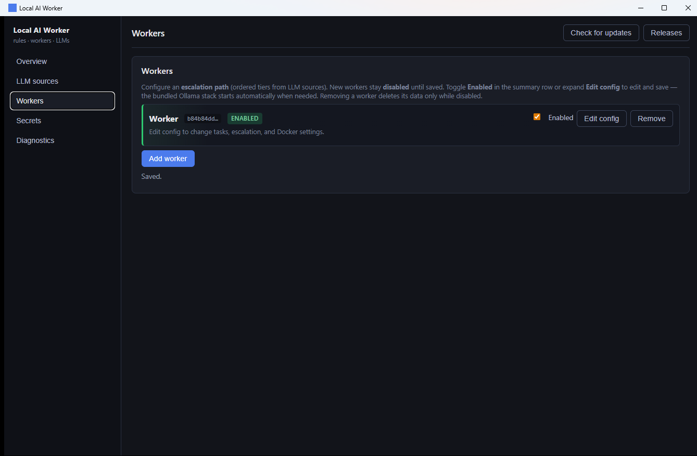
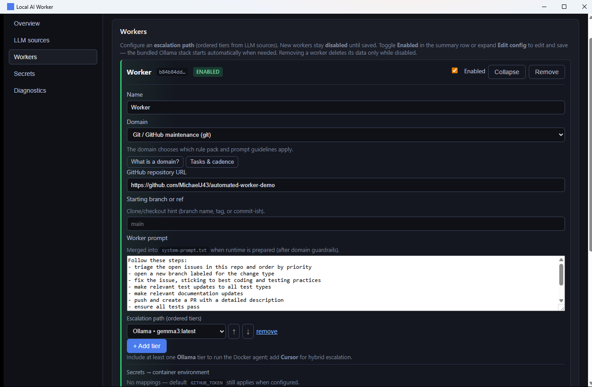
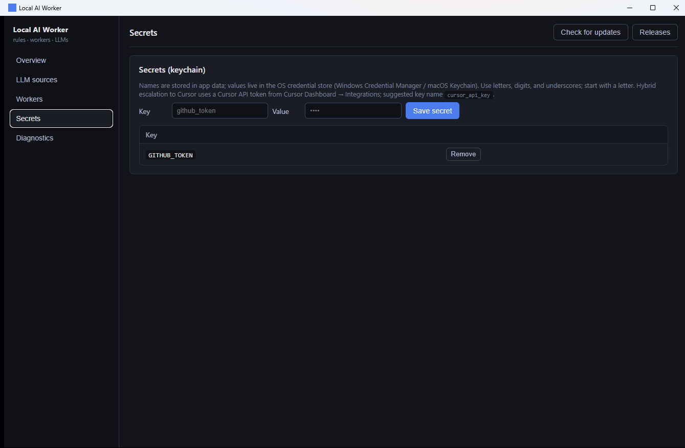
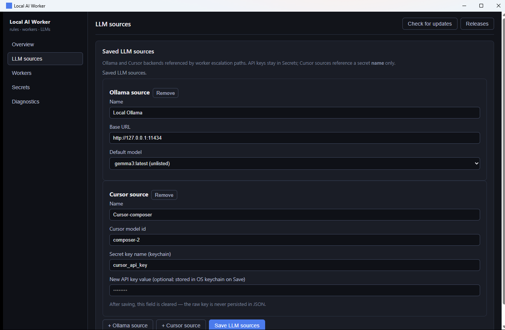
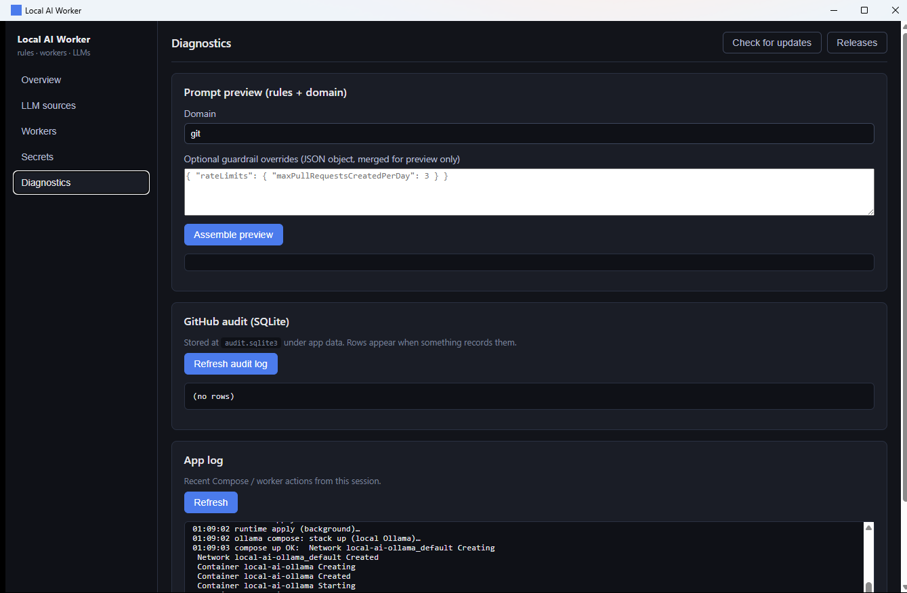
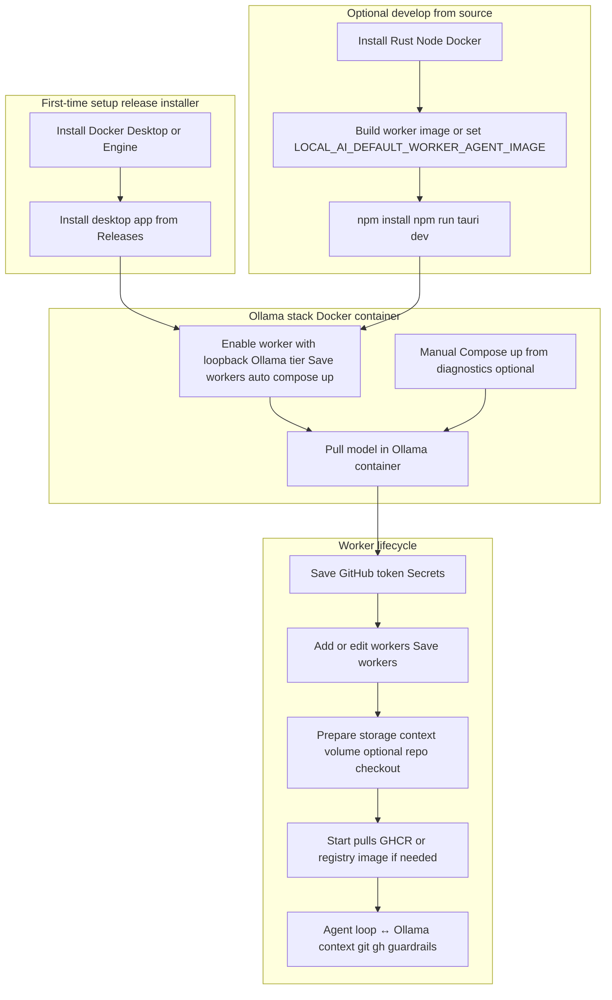

# Local AI Worker — User guide

## UI tour

Screenshots below live under [`docs/images/`](images/).

### Overview

High-level environment and stack controls (hardware hints, Ollama compose, model tags).



### Workers

Collapsed summary of configured workers (expand for full editor per worker).



Expanded worker editor (storage, container actions, repo URL, advanced options).



### Secrets

GitHub token entry (stored in the OS secure store; injected into worker containers).



### LLM sources

Configure how the app reaches models (host, tags, related settings).



### Diagnostics

Host and Docker diagnostics useful when troubleshooting compose or containers. **Docker images** lists pinned Compose images, the bundled default worker image reference, and each worker’s resolved image, with whether Docker already has the image locally (`docker image inspect`).



## Process overview

End-to-end flows from setup through a running worker.



If you configure a **GitHub repository URL** (and branch) on a worker, **Prepare / Start** also clones or syncs under `workers/<id>/checkout` and mounts it at **`/workspace/repo`**; the container then runs the **structured JSON repo agent loop** with **observe / apply_git / apply_github** tiers instead of only the legacy free-text loop (see **Workers** below).

At runtime the desktop UI invokes **Tauri commands**, which persist **`workers.json`**, drive **Docker CLI**, and use **`ai_worker_core`** for rules, context files, audit SQLite, and Ollama HTTP. Worker containers mount context, **`guardrails.effective.json`**, optional **`/workspace/repo`**, **`GITHUB_TOKEN`**, and **`/persist`** (including shared **`audit.sqlite3`** where configured).

## What it does

- Runs **Ollama** only via **Docker Compose** (bundled YAML + optional GPU file copied under app data), not as a host daemon. You can still mirror the same stack with the repo root `docker-compose.yml`.
- Manages **workers**: JSON config, optional **guardrail overrides**, **tasks** (one-shot or cadence).
- Prepares **per-worker storage**: context file on disk + Docker **volume** for long-term data, then can **start/stop/recreate** an **agent container**.
- **Agent loop** (in the worker image): background script calls **Ollama** on a poll interval, sends tasks + context, and updates `context.json` (requires a pulled model and running Ollama stack).
- **Guardrail enforcement (v1)**: `git` and `gh` in the container go through **`worker-guard`** (rate limits, branch/delete rules, merge policy, optional repo allow/deny via `AI_WORKER_REPO`). State lives under `/persist` on the worker volume; **audit** rows can be written to the **same** `audit.sqlite3` the app uses (mounted read/write into the container).
- Stores a **GitHub token** in **Windows Credential Manager** or **macOS Keychain** (the app injects it as **`GITHUB_TOKEN`** into worker containers and uses it for host-side clone/fetch over HTTPS).
- Keeps a **GitHub audit** SQLite DB and an in-app **action log**.

## First-time setup

### Using a release installer

1. Install **Docker** (Docker Desktop on macOS/Windows, or Docker Engine + Compose on Linux) and confirm **`docker info`** works (Overview / Diagnostics show **Docker: OK**).
2. Install the app from **GitHub Releases**. Releases compile in a default **GHCR** worker image (`ghcr.io/<owner>/local-ai-worker-agent:<appVersion>`); starting a worker runs **`docker pull`** when needed — no local `docker build` for normal use.
3. In **LLM sources**, keep (or add) an Ollama tier pointing at **loopback** (`http://127.0.0.1:11434` or `localhost`). When you **enable** a worker that uses that tier and **Save workers**, the app runs **Compose up** for the bundled Ollama stack automatically (optional GPU merge when `nvidia-smi` is present). You can still use **Ollama stack → Compose up** manually from diagnostics.
4. Pull a model inside the container, e.g. `docker exec -it local-ai-ollama ollama pull gemma4:e2b`.
5. Save your **GitHub token** under **Secrets** if workers need GitHub or private repos.

Use **Diagnostics → Docker images** to see which refs will be pulled and whether they are already present locally.

### Developing from this repository

1. Install **Rust**, **Node.js**, and **Docker** as above.
2. Default **`cargo`** builds use **`local-ai-worker-agent:latest`** unless you set **`LOCAL_AI_DEFAULT_WORKER_AGENT_IMAGE`** to a GHCR tag before building (same mechanism as release CI). Either build from source:

   ```bash
   docker build -f docker/Dockerfile.worker -t local-ai-worker-agent:latest .
   ```

   …or point the env var at a published GHCR image and rebuild the app.

3. Run `npm install` then `npm run tauri dev`.

### GitHub token (PAT) — not `gh auth login`

Worker containers do **not** use interactive **`gh auth login`**. The entrypoint sets **`GH_TOKEN`** from **`GITHUB_TOKEN`** so **`gh`** always authenticates with your stored PAT.

- **Fine-grained PAT** (recommended for a single repo): create a token limited to that repository; grant the API permissions your maintenance flow needs (e.g. Contents, Pull requests, Issues, Metadata). Use the normal **`https://github.com/owner/repo.git`** URL in the worker — no need to bake the token into the URL in the UI.
- **Classic PAT** still works.
- Host **clone/fetch** embeds the token only transiently for HTTPS Git operations using the **`x-access-token`** form GitHub documents for PATs; the checkout’s **`origin`** remote is stored without credentials on disk after sync.

## Workers

1. **Add worker** → **Save workers**.
2. **Prepare storage** — creates `context.json` under app data (`…/local-ai-worker/workers/<id>/`) and a Docker volume `local-ai-lt-…` unless you override paths in saved JSON (advanced).
3. **Start container** — runs `docker run` with:
   - Context file at `/workspace/context.json`
   - Materialized **`guardrails.effective.json`**, **`system-prompt.txt`**, **`agent-config.json`** (under `workers/<id>/` on the host)
   - Host **`audit.sqlite3`** mounted at `/persist/audit.sqlite3` (shared with the app)
   - Long-term volume at `/persist`
   - `OLLAMA_HOST` (per worker or default `http://host.docker.internal:11434`)
   - `GITHUB_TOKEN` if you saved a token
   - **`AI_WORKER_REPO=owner/repo`** (optional): required when **repository allowlist** is enforced so `git`/`gh` wrappers can validate scope.
4. **Recreate** = stop + start (fresh container, same mounts). After upgrading the app, **`docker pull`** the default GHCR tag (see **Diagnostics → Docker images** for the resolved ref) so worker containers match the release.

**Default image:** release installers embed **`ghcr.io/<owner>/local-ai-worker-agent:<version>`**; local dev builds default to **`local-ai-worker-agent:latest`**. Override per worker as **Docker image** when needed.

### Repository checkout + repo agent loop (structured JSON)

If you set **GitHub repository URL** (and optionally **Starting branch or ref**) on a worker, Prepare / Start will clone or sync under app data at `workers/<id>/checkout` and mount that tree at **`/workspace/repo`** inside the container. The entrypoint then runs the **repo agent loop** (`AI_REPO_AGENT=1`) instead of the older free-text loop:

- The model must answer with **one JSON object** (`reflection` plus optional `commands[]` of `argv` arrays). Invalid JSON is logged to context and a redacted **host** file `workers/<id>/repo-agent-runtime.log`.
- **Advanced → Repo autonomous execution tier**
  - **`observe`**: proposals are recorded; only scripted read-only repo facts run in the prompt.
  - **`apply_git`**: runs **guarded `git`** proposals (PATH wrappers → `worker-guard`); **`gh`** proposals are skipped unless you raise the tier.
  - **`apply_github`**: runs guarded **`git` and `gh`** proposals.
- **Allowed test profiles (JSON)**: optional whitelisted commands (bare names like `npm` or `pnpm`, no path separators) plus `argv`. They run from the repo root **after** model-proposed commands each cycle, only when the tier is **`apply_git`** or **`apply_github`**. Extend the worker image if those tools are missing.
- **Secrets**: host clone/fetch uses the same saved **GitHub token** as the container (never shown in the UI log file; best-effort patterns are still redacted from context + `repo-agent-runtime.log`).

End users on releases should **`docker pull`** the matching GHCR worker tag after upgrades. Contributors changing **`docker/`** scripts or **`worker-guard`** should rebuild locally:

`docker build -f docker/Dockerfile.worker -t local-ai-worker-agent:latest .`

See **`docs/REPO_AGENT_SANDBOX.md`** for sandbox policy flags and Docker network tradeoffs.

### Optional: disable the agent loop

The container entrypoint starts the loop unless you set **`AI_AGENT_LOOP=0`** (advanced / manual `docker run` only; the desktop app currently always enables the loop).

## Rules

Bundled **Git** domain guardrails live in `docs/rules/rules-tree.json`. Optional **Guardrail overrides** on each worker are deep-merged into **`guardrails.effective.json`** for prompts and for **`worker-guard`** enforcement inside the container.

## Data locations (typical Windows)

- App root: `%LOCALAPPDATA%\local-ai-worker\`
- Workers: `workers.json`, `workers/<id>/context.json`, `workers/<id>/guardrails.effective.json`, `workers/<id>/system-prompt.txt`, `workers/<id>/agent-config.json`, `workers/<id>/repo-agent-runtime.log` (repo loop only), optional `workers/<id>/checkout/` (cloned repo), `compose/`, `audit.sqlite3`

## Audit

**Refresh audit log** reads `github_audit` rows (newest first). **`worker-guard`** may append rows when **`gh`** / **`git`** operations succeed or fail (according to `auditPolicy` in the rules tree).
