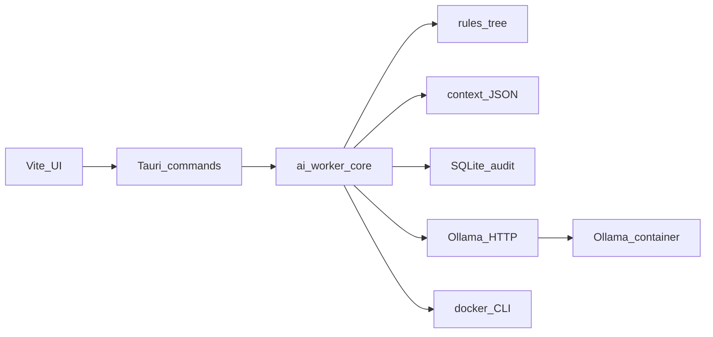

# Architecture (v1)

- **UI**: `src/` — workers editor, token entry, Docker/hardware status, Ollama tag list, prompt preview.
- **Tauri**: `src-tauri/` — persists `workers.json` under the OS app data dir; **keyring** for GitHub PAT; invokes core helpers.
- **Core**: `crates/ai_worker_core/` — rules loading/merge, `WorkerContext` file I/O, rolling rate limit tables, audit schema, `reqwest` Ollama client, `sysinfo` probe, Docker CLI probe.

Worker **containers** and full **orchestration** (create/recreate, volume mounts, command wrappers) are planned extensions; the worker `Dockerfile` under `docker/` provides a base Ubuntu image with `git` and `gh`.
