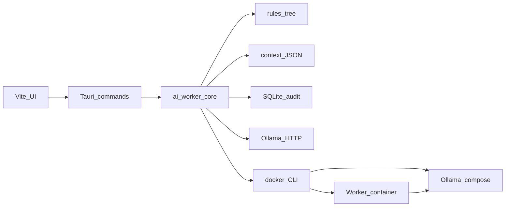

# Architecture (v1)

- **UI**: `src/` — workers editor, token entry, Docker/hardware status, Ollama tag list, prompt preview.
- **Tauri**: `src-tauri/` — persists `workers.json` under the OS app data dir; **keyring** for GitHub PAT; invokes core helpers and Docker for compose / worker lifecycle.
- **Core**: `crates/ai_worker_core/` — rules loading/merge, `WorkerContext` file I/O, rolling rate limit tables, audit schema, `reqwest` Ollama client, `sysinfo` probe, Docker CLI probe.

Worker **containers** are built from `docker/Dockerfile.worker`: agent loop, optional repo agent JSON loop, **`worker-guard`**-wrapped **`git`** / **`gh`**, mounts for context, repo checkout, **`/persist`**, and shared **`audit.sqlite3`** when configured.

For a labeled **process** flow (setup → Ollama → workers → optional repo agent), see the Mermaid diagram in [`USER_GUIDE.md`](USER_GUIDE.md#process-overview). UI screenshots live under [`docs/images/`](images/).
